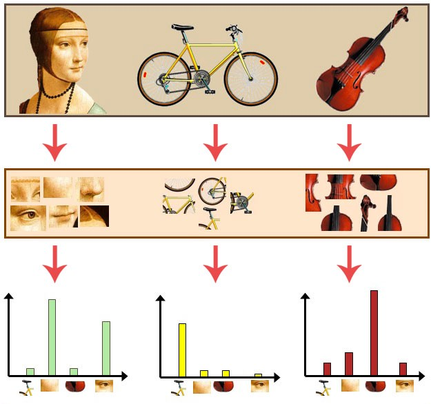

# Image Classification with Bag of Visual Words and SVM
This demo showcases the power of the BoVW (bag of visual words) technique for image classification.
I was able to achieve a 90% accuracy on 4 classes of images of the caltech101 dataset. 

## Concepts
The BoVW technique was inspired by the BoW (bag of words) technique used for document classification, information 
retrieval and other problems. The idea is that for each document, we count the number of occurences for each
distinct word and build an histogram. Each document will then have an histogram that can be compared for similarities
for example. Imagine we are classifying books of different genres: self-help, travel, science fiction, cooking and others.
It's reasonable to think that depending on the genre, we'll find more or less occurences of certain words.
We can train a classifier to then learn what are the distributions that most likely indicate if the book is about
travelling or about science fiction. 

The same idea applies for images. Imagine each image is a document. Like text documents, images here will also have
"words" but we are going to call them "visual words". To define these words, we need to follow three steps: 
feature detection, feature description, and codebook generation.

Feature detection finds interest points in an image. Those points are usually found in corners or areas of the image 
with high entropy (lots of texture). I am using SIFT for feature detection in this demo. 

Feature description methods deal with how to represent the patches as numerical vectors. These vectors are 
called feature descriptors or feature vectors. A good descriptor should have the ability to handle intensity,
rotation, scale and affine variations to some extent. For this step, we have used the SIFT feature extractor.
SIFT converts each patch to 128-dimensional vector.  After this step, each image is a collection of vectors of the same
dimension (128 for SIFT), where the order of different vectors is of no importance. [1]

Codebook generation is the final step for the BoW model where we convert vector-represented patches to "codewords" 
(analogous to words in text documents), which also produces a "codebook" (analogy to a word dictionary). 
A codeword can be considered as a representative of several similar patches. 
One simple method is performing k-means clustering over all the vectors.
Codewords are then defined as the centers of the learned clusters. 
The number of the clusters is the codebook size (analogous to the size of the word dictionary). [1]

Thus, each patch in an image is mapped to a certain codeword through the clustering process
and the image can be represented by the histogram of the codewords.
 
Here is a diagram depicting this whole process:

 


## Tutorial
### Time to run
4-5 minutes

### Dataset
I have used a subset of http://www.vision.caltech.edu/Image_Datasets/Caltech101/

I selected the following 4 classes (airplanes, Faces_easy, Leopards and Motorbikes) and picked
200 images for each class.

The train-test split was 70-30 while making sure that the classes were perfectly balanced in both datasets. 
I had to do this as SVM is very sensitive to class imbalance.


### Explaining the Code
In this section, I'll briefly go over some major parts of the code.

The first part is dividing the dataset into train and test:
````python
# split into train and test datasets
X_train, X_test, y_train, y_test = split_train_test(input_path)
````

Next, I extract the feature vectors for each image in the training dataset. 
Remember that each image will generate a list of 128-dim 
feature vectors (one feature vector for each keypoint detected):
```python
# extract SIFT feature vectors for all images and concatenate them all into all_feature_vectors
all_feature_vectors = np.empty((0, 128))
for f in X_train:
    img = cv2.imread(f)
    feature_vectors = extract_feature(img)
    all_feature_vectors = np.concatenate((all_feature_vectors, feature_vectors), axis=0)
```

With all these features vectors from the training dataset, I'll run k-means to clusterize them. I chose 30 clusters
which means that my codebook will have 30 words:
```python
# clusterize using kmeans
kmeans = cluster(all_feature_vectors)
```

Having defined the codebook, it's time to generate the bag of visual words for each image (still in the training dataset).
I simply use the function generate_bag_of_words() which will use predict() in the kmeans I just fitted to get
the cluster (or the code word) for each feature vector. I also have to normalize the bag of words which means
I am turning a histogram of absolute counts into a a vector where every element will be between the range [0, 1]. 
SVM requires normalized feature vectors (see an explanation in [9]).
```
# generate the bag of visual words for each image and concatenate them all it into train_bags
train_bags = np.empty((0, NUM_CLUSTERS))
for f in X_train:
    img = cv2.imread(f)
    bag = generate_bag_of_words(img, kmeans)
    train_bags = np.vstack((train_bags, bag))

# normalize all bags
train_bags = StandardScaler().fit_transform(train_bags)
```

I then train the classifier with all the bags:
```
# train SVM
clf = SVC(gamma='auto')
clf.fit(train_bags, y_train)
```

And then I test the accuracy of this classifier with the test dataset:
```
# generate bag of visual words for images in the test dataset
test_bags = np.empty((0, NUM_CLUSTERS))
for f in X_test:
    img = cv2.imread(f)
    bag = generate_bag_of_words(img, kmeans)
    test_bags = np.vstack((test_bags, bag))

# normalize all bags
test_bags = StandardScaler().fit_transform(test_bags)

# test accuracy
score = clf.score(test_bags, y_test)
print('Overall accuracy (test dataset):', score)
y_pred = clf.predict(test_bags)
```

### Results
In this section, the results of this demo. 
You can see the confusion matrix with absolute counts and normalized.
The results were very satisfactory as the overall accuracy was 0.916. The confusion matrices show that most of the
predictions were right on the diagonal which indicates an accurate prediction. 

Non Normalized Confusion Matrix            |  Normalized Confusion Matrix
:-------------------------:|:-------------------------:
  |  

Here you can see the a 2D plot of the training dataset in its ground truth and predictions versions. Most of the data
points match in both plots which confirms the high accuracy seen in the confusion matrices. 
I have used PCA to reduce dimensionality (from 30D to 2D).

Ground Truth             |  Predicted
:-------------------------:|:-------------------------:
  |  

Here, I plotted the K-Means clustering of the training dataset. As the number of feature vectors is very high and
the dimensionality was reduced from 30D to 2D, we can't really see much separation between the clusters. 
Nevertheless, it's still possible to recognize some regions where a particular color is concentrated.

 


# References
1. https://en.wikipedia.org/wiki/Bag-of-words_model_in_computer_vision
2. https://gurus.pyimagesearch.com/the-bag-of-visual-words-model/
3. https://www.youtube.com/watch?v=iGZpJZhqEME
4. http://people.csail.mit.edu/torralba/shortCourseRLOC/
5. https://towardsdatascience.com/bag-of-visual-words-in-a-nutshell-9ceea97ce0fb
6. https://github.com/kushalvyas/Bag-of-Visual-Words-Python
7. http://www.vision.caltech.edu/Image_Datasets/Caltech101/
8. https://kushalvyas.github.io/BOV.html#BOV
9. https://stats.stackexchange.com/questions/57010/is-it-essential-to-do-normalization-for-svm-and-random-forest